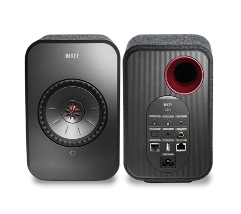

# KefControl.gadget
 Windows gadget to control KEF LSX

<B>Introduction</B>

If you are using KEF LSX as PC speakers with an optical connection, you may not be able to change the speakers volume using standard Windows volume control. This Windows gadget provides basic features to control KEF LSX speakers. The gadget also "pools" the LSX speakers every 50 minutes to prevent standby and detects when PC wakes up from standby in order to also wake up the speakers.

<B>Supported features</B>

- Adjust volume
- Select current output (wake up from standby)
- Prevent LSX standby by selecting current output each 50 minutes
- Detect exit from standby and wake up speakers

<B>Powershell script</B>

The kefctrl.ps1 powershell script is used by the gadget to control the LSX. kefctrl.ps1 needs to be used with the following arguments :

keyctrl.ps1 &lt;IP&gt; &lt;inc|dec|aux|opt&gt;

<table>
<tr><td>IP</td><td>LSX IP address or hostname</td></tr>
<tr><td>inc</td><td>10% volume increase</td></tr>
<tr><td>dec</td><td> 10% volume decrease</td></tr>
<tr><td>aux</td><td> select aux output</td></tr>
<tr><td>opt</td><td> select optical output</td></tr>
</table>

<B>Installation</B>

To use this gadget on Windows 10, you need to have <a href="https://8gadgetpack.net/">8gadgetpack</a> or similar tool installed.
Then, download the project and copy the KefControl.gadget directory to C:\Users\username\AppData\Local\Microsoft\Windows Sidebar\Gadgets\. You should then be able to add the "Kef Control" gadget. Make sure to configure the gadget with the correct IP address/hostname for your LSX speakers.

<B>License</B>

MIT License

<B>Contributions</B>

Emmanuel Boersma 
Any collaboration welcome !
